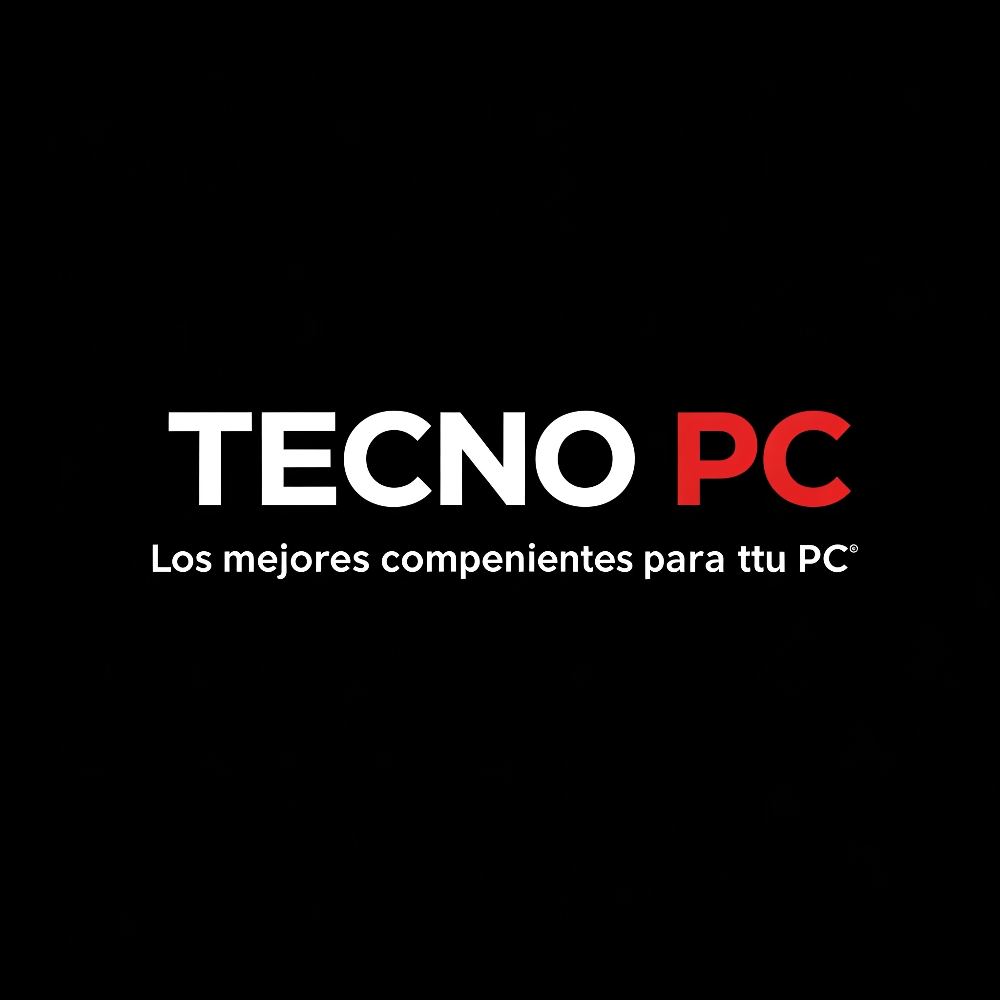

# TecnoPC



Los mejores componentes para tu PC.

Este programa es funcional en Python 3.13. **No probado en otras versiones.**

## Requisitos

- Instala las dependencias necesarias.

```shell
pip install -r requirements.txt
```

- En caso de querer desarrollar, instala las dependencias adicionales.

```shell
pip install -r requirements.dev.txt
```

- Ejecuta ```data.py``` para generar los datos iniciales del modelo.

```shell
python data.py
```

## Ejecución del programa

- Ejecuta el archivo main.py.

```shell
python main.py
```

## Estructura del proyecto

### assets

- Contiene recursos tales como la imagen de TecnoPC.

### package

- Contiene la implementación del patrón de arquitectura [Modelo–vista–modelo de vista](https://es.wikipedia.org/wiki/Modelo%E2%80%93vista%E2%80%93modelo_de_vista).

### ui

- Contiene las interfaces de usuario las cuales son usadas por la vista.

### Carpeta raíz

- data.py: Script para generar el archivo JSON inicial usado por el modelo.
- main.py: Script para ejecutar TecnoPC.

## Software necesario

### Uso

- [Python](https://www.python.org/)

### Desarrollo

- [Git](https://git-scm.com/)
- [PyCharm](https://www.jetbrains.com/pycharm/) o algún programa similar

## Licencia

- El repositorio está licenciado bajo la licencia MIT. Más información [aquí](https://github.com/JustLobo1121/TecnoPC/blob/main/LICENSE).

## Buenas prácticas

Lo siguiente solo aplica para desarrollo.

### Linting de archivos .py

- Escanear código por posibles problemas.

```shell
pylint <file>
```

- \<file> debe ser algún archivo .py, como por ejemplo **main.py**.

### Linting de archivos .md

- Escanear documentación por posibles problemas.

```shell
pymarkdownlnt scan <file>
```

- **Intentar** corregir posibles problemas de forma automática.

```shell
pymarkdownlnt fix <file>
```

- \<file> debe ser algún archivo .md, como por ejemplo **README.md**.

### Commits

- Usar [Conventional Commits](https://www.conventionalcommits.org/en/v1.0.0/)
para los mensajes de commits.

- [Sumario rápido](https://www.conventionalcommits.org/en/v1.0.0/#summary) de
Conventional Commits
