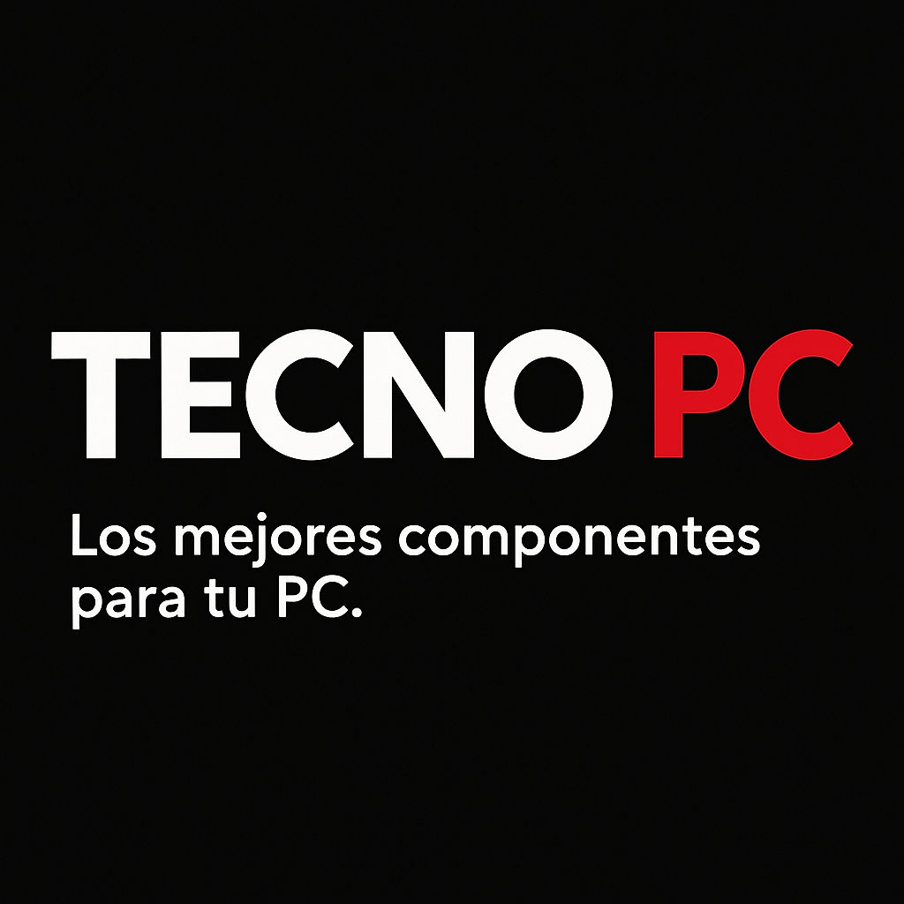

# TecnoPC

**Los mejores componentes para tu PC**

Este programa es funcional (de momento) en Python 3.13.2  **No probado en otras versiones**

## Requisitos

En caso de querer desarrollar, instalar las dependencias necesarias usando:

> pip install -r requirements.dev.txt -r requirements.txt

En caso de querer solo ejecutar el programa, instalar las dependencias necesarias usando:

> pip install -r requirements.txt

## Ejecutacion del programa

- Mover archivo *model_unit_test.py* a la carpeta raiz (Mismo nivel quie el archivo main), para que se ejecuten los datos

- Luego de eso si ejecutar el archivo main.py escribiendo en la terminal:

> python main.py

## Estructura de los archivos momentanea

### Package

Modelos del programa para la ejecucion de la interfaz

### Scripts

Se encuentra el archivo de model_unit_test.py para poder generar todo lo que son datos 

#### Temp

Subcarpeta dentro de Scripts la cual contiene todos los controladores del programa

### UI

Archivos UI los cuales mantienen las interfaces (Deja agrupado los archivos de interfaces)

#### De manera suelta se encuentra el archivo main en la carpeta raiz

## Software necesario

### Desarrollo

* [Git](https://git-scm.com/)

### Uso

* [Python](https://www.python.org/)

## Software recomendado

* [PyCharm](https://www.jetbrains.com/pycharm/): IDE para programar en Python
(Gracias Esteban por tanto)

## Licencia

* El repositorio esta licenciado bajo la licencia MIT, la puedes ver por [aquí](https://github.com/Matiti061/TecnoPC/blob/main/LICENSE)

## PARA HACER

Solo para uso interno de programadores en este repositorio

### Necesario

* [X] OK: Agregar funcion de inicio de sesion (Funcion lista implementada en la rama main)
* [x] OK: Agregar funciones de Busqueda de productos, Agregar item,
Finalizar Venta, agregar estadisticas (Archivo: interfaz_tienda.py)
* [X] OK: Agregar la funcion de poder cancelar una venta de manera rapida
* [X] OK: Agregar tabla de ID de productos, Nombre, tipo, etc.
* [X] OK: Colocar un filtro de busqueda de los productos
* [X] OK: Poder cambiar entre tiendas al igual que entre vendedores en el
apartado de Ventas
* [X] OK: Agregar algun tipo de limite al lugar de agregar items en la pestaña
de Ventas
* [X] OK: Poder calcular las comisiones de cada vendedor (Plus para que el profe
nos quiera mucho, aunque falta mejorarlo)
* [x] OK: Cambiar la moneda de dolares a pesos chilenos (USD to CLP)

### No tan necesario but to do igual

* [X] OK: Mejorar el diseño de la pagina con Qt Designer o algun otro editor
* [X] OK: Cambiar las ciudades de las tiendas (Hay ciudades aleatorias
las cuales tienen nombres de PM pero se ubican en las ciudades que mas venden de
cada sector de Chile) (Si quieren poner alguna tienda, adelante)
* [X] OK: Poner limite al lugar de "Precio Max" en el apartado de Inventario

